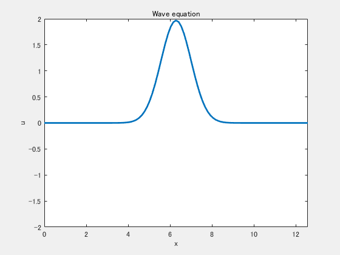

# Finite differences for the wave equation

This repo provides an example implementation of a simple numerical schemes for the 1D and 2D wave equation.

To open the repo in MATLAB Online, please click

To view this file on File Exchange, please click

## 1D case

See [Simple1DWaveEquation.md](./Simple1DWaveEquation.md) or click 
 to open the livescript in MATLAB Online.

## 2D case

See [Simple2DWaveEquation.md](./Simple2DWaveEquation.md) or click 
 to open the livescript in MATLAB Online.

Copyright 2015-2023 The MathWorks, Inc.
