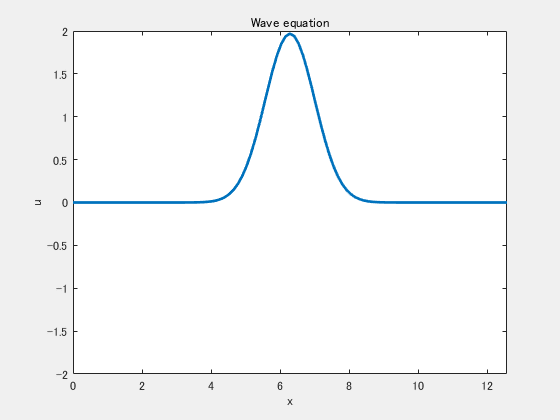
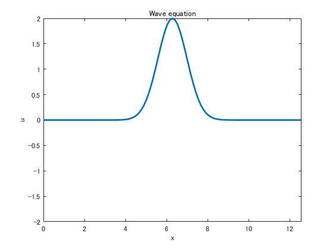
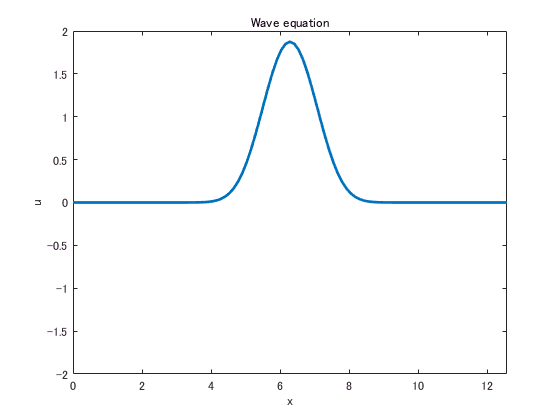

# <span style="color:rgb(213,80,0)">Finite differences for the wave equation</span>

Implementation of a simple numerical schemes for the wave equation.

 $$ \frac{\partial^2 u}{\partial t^2 }=c^2 \frac{\partial^2 u}{\partial x^2 }. $$ 

Applying the second-order centered differences to approximate the derivatives,

 $$ \frac{u_j^{n+1} -2u_j^n +u_j^{n-1} }{\Delta t^2 }=c^2 \frac{u_{j+1}^n -2u_j^n +u_{j-1}^n }{\Delta x^2 }. $$ 

It can be arrange to obtain

 $$ u_j^{n+1} =s(u_{j+1}^n +u_{j-1}^n )+2(1-s)u_j^n -u_j^{n-1} , $$ 

where

 $$ s=c^2 \frac{\Delta t^2 }{\Delta x^2 }. $$ 

It is known that the scheme needs to satisfy  $s\le 1$ for stability. Copyright 2015-2016 The MathWorks, Inc.




# Proboem Setup
```matlab
N = 101;
L = 4*pi;
x = linspace(0,L,N);

% It has three data set; 1: past, 2: current, 3: future.
u = zeros(N,3);
s = 0.5;
```
# Initial Condition
```matlab
% Gaussian Pulse
y = 2*exp(-(x-L/2).^2);
u(:,1) = y;
u(:,2) = y;

% Plot the initial condition.
handle_line = plot(x,u(:,2),'LineWidth',2);
axis([0,L,-2,2]);
xlabel('x'); ylabel('u');
title('Wave equation');
```

<center></center>

# Boundary condition
```matlab
% Dirichet Boundary conditions
u(1,:) = 0;
u(end,:) = 0;
```
# Simulation
```matlab
filename = 'wave.gif';
for ii=1:100
    disp(['at ii= ', num2str(ii)]);
    u(2:end-1,3) = s*(u(3:end,2)+u(1:end-2,2)) ...
        + 2*(1-s)*u(2:end-1,2) ...
        - u(2:end-1,1);
    u(:,1) = u(:,2);
    u(:,2) = u(:,3);
    handle_line.YData = u(:,2);
    drawnow;
    frame = getframe(gcf);
    im = frame2im(frame);
    [A,map] = rgb2ind(im,256);
    if ii==1
           imwrite(A,map,filename,'gif','LoopCount',Inf,'DelayTime',0.05);
    else
        imwrite(A,map,filename,'gif','WriteMode','append','DelayTime',0.05);
    end
end
```

<center></center>

