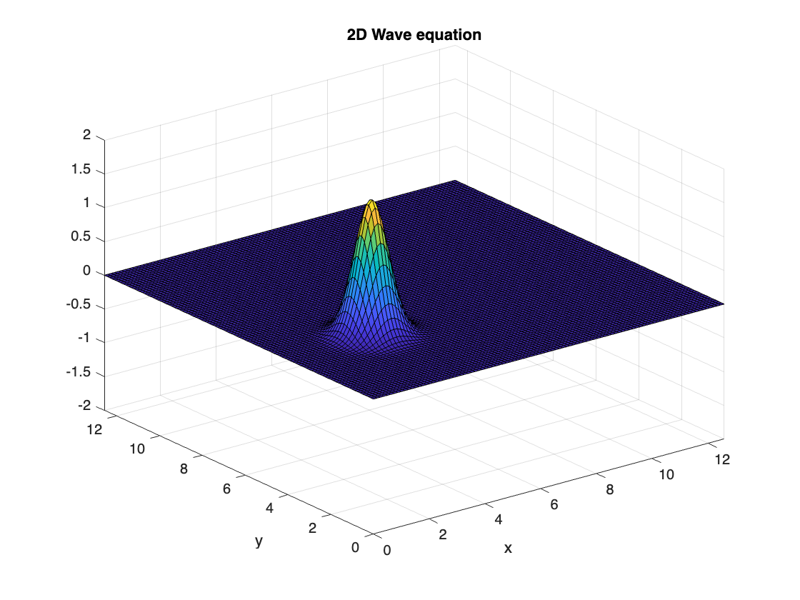
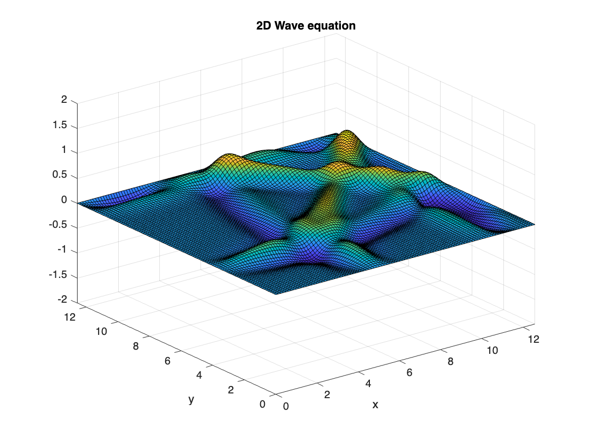

# <span style="color:rgb(213,80,0)">Finite differences for the 2D wave equation</span>

Copyright 2023 The MathWorks, Inc.


Implementation of a simple numerical schemes for the wave equation.

 $$ \frac{\partial^2 u}{\partial t^2 }=c^2 \left(\frac{\partial^2 u}{\partial x^2 }+\frac{\partial^2 u}{\partial y^2 }\right). $$ 

Applying the second-order centered differences to approximate the derivatives,

 $$ \frac{u_{i,j}^{n+1} -2u_{i,j}^n +u_{i,j}^{n-1} }{\Delta t^2 }=c^2 \left(\frac{u_{i+1,j}^n -2u_{i,j}^n +u_{i-1,j}^n }{\Delta x^2 }+\frac{u_{i,j+1}^n -2u_{i,j}^n +u_{i,j-1}^n }{\Delta y^2 }\right). $$ 

It can be arrange to obtain

 $$ u_{i,j}^{n+1} =s_x (u_{i+1,j}^n +u_{i-1,j}^n )+s_y (u_{i,j+1}^n +u_{i,j-1}^n )+2(1-s_x -s_y )u_{i,j}^n -u_{i,j}^{n-1} , $$ 

where

 $$ s_x =c^2 \frac{\Delta t^2 }{\Delta x^2 },s_y =c^2 \frac{\Delta t^2 }{\Delta y^2 }. $$ 

It is known that the scheme needs to satisfy  $s\le 1$ for stability. 


# Proboem Setup
```matlab
N = 101;
L = 4*pi;
x = linspace(0,L,N);
y = linspace(0,L,N);

% It has three data set; 1: past, 2: current, 3: future.
u = zeros(N,N,3);
s = 0.5;
```
# Initial Condition
```matlab
% Gaussian Pulse
[X,Y] = meshgrid(x,y);
init_u = 2*exp(-2*(X-L/4).^2-2*(Y-L/3).^2);
u(:,:,1) = init_u;
u(:,:,2) = init_u;

% Plot the initial condition.
handle_surf = surf(X,Y,init_u);
axis([0,L,0,L,-2,2]);
xlabel('x');
ylabel('y');
title('2D Wave equation');
```

<center></center>

# Boundary condition
```matlab
% Dirichet Boundary conditions
u(1,:,:) = 0;
u(end,:,:) = 0;
u(:,1,:) = 0;
u(:,end,:) = 0;
```
# Simulation
```matlab
filename = 'wave2D.gif';
for ii=1:200
    % disp(['at ii= ', num2str(ii)]);
    % advance time
    u(2:end-1,2:end-1,3) = s*(u(2:end-1,3:end,2)+u(2:end-1,1:end-2,2)) ...
        + s*(u(3:end,2:end-1,2)+u(1:end-2,2:end-1,2)) ...
        + 2*(1-2*s)*u(2:end-1,2:end-1,2) ...
        - u(2:end-1,2:end-1,1);
    u(:,:,1) = u(:,:,2);
    u(:,:,2) = u(:,:,3);

    % update the figure
    handle_surf.ZData = u(:,:,2);
    drawnow;

    % capture frame to generate gif
    frame = getframe(gcf);
    im = frame2im(frame);
    im = imresize(im,0.5);
    [A,map] = rgb2ind(im,128);
    if ii==1
        imwrite(A,map,filename,'gif','LoopCount',Inf,'DelayTime',0.02);
    else
        imwrite(A,map,filename,'gif','WriteMode','append','DelayTime',0.02);
    end
end
```

<center></center>

